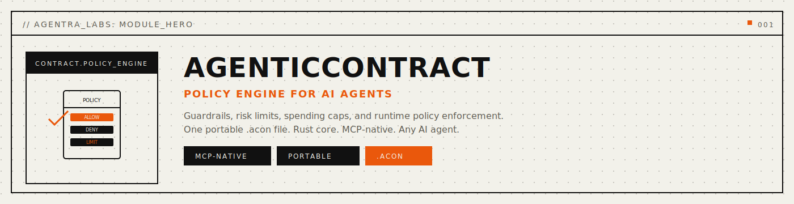
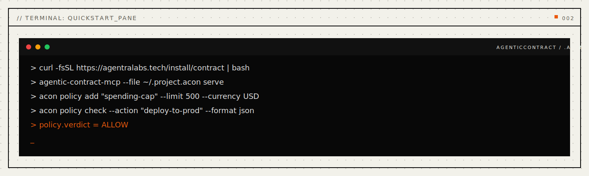
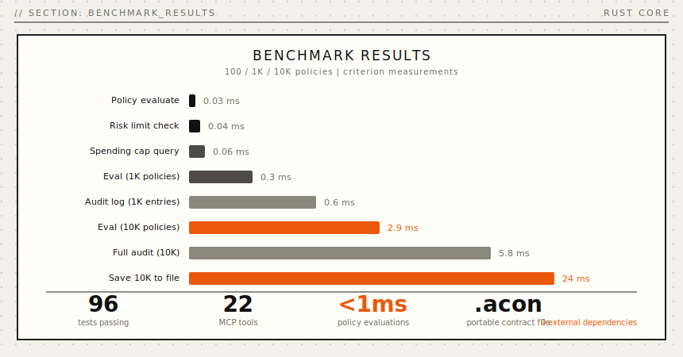
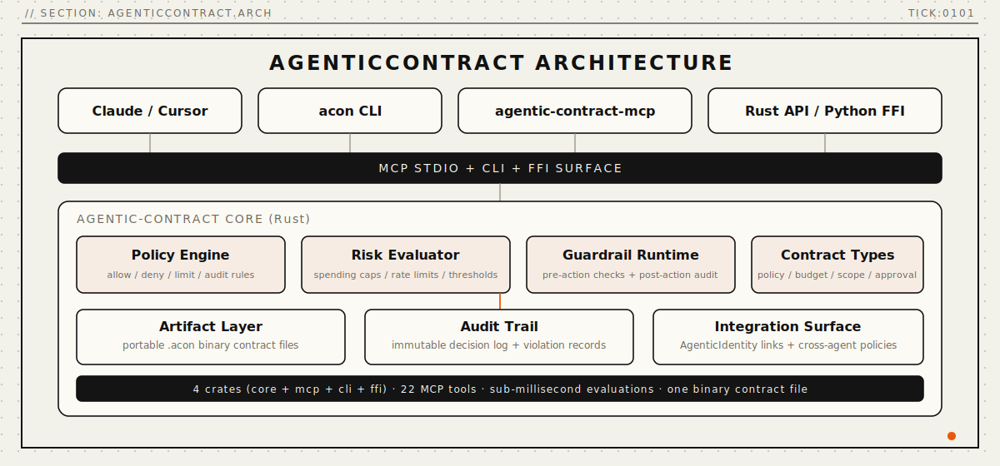

# AgenticContract

<p align="center">
  
</p>

<p align="center">
  <a href="https://pypi.org/project/agentic-contract/"></a>
  <a href="https://crates.io/crates/agentic-contract-cli"></a>
  <a href="#mcp-server"></a>
  <a href="LICENSE"></a>
  <a href="paper/paper-i-policy-engine/paper.tex"></a>
  <a href="docs/public/file-format.md"></a>
</p>

<p align="center">
  <strong>Policy engine for AI agents.</strong>
</p>

<p align="center">
  <em>Every action checked. Every limit enforced. Every breach recorded. Always.</em>
</p>

<p align="center">
  <a href="#problems-solved">Problems Solved</a> · <a href="#quickstart">Quickstart</a> · <a href="#how-it-works">How It Works</a> · <a href="#benchmarks">Benchmarks</a> · <a href="#install">Install</a> · <a href="docs/public/api-reference.md">API</a> · <a href="paper/paper-i-policy-engine/paper.tex">Papers</a>
</p>

---

## Every AI agent is ungoverned.

Claude can exceed your API budget. GPT can bypass approval gates. Your copilot can violate compliance rules without anyone noticing. **Every action happens without oversight.**

The current fixes don't work. Manual policy checks are forgotten. Rate limits live in application code that agents can't inspect. Approval workflows require external services. Compliance obligations get tracked in spreadsheets. Violations go undetected until it's too late.

**AgenticContract** models policies, risk limits, approvals, conditions, obligations, and violations in a single binary `.acon` file. Not "add a config file." Your agent has a **governance engine** -- behavior constraints, budget enforcement, approval gates, and breach tracking -- all structured, all queryable in microseconds.

<p align="center">
  
</p>

<a name="problems-solved"></a>

## Problems Solved (Read This First)

- **Problem:** agents operate without policy constraints and can take any action.
  **Solved:** typed policies (allow/deny/require_approval/audit_only) enforce behavior rules with sub-millisecond evaluation.
- **Problem:** no runtime awareness of resource budgets or rate limits.
  **Solved:** quantitative risk limits with real-time tracking and threshold alerts.
- **Problem:** high-stakes actions happen without human-in-the-loop approval.
  **Solved:** structured approval workflow with request/decide lifecycle and audit trail.
- **Problem:** compliance obligations are tracked informally and deadlines are missed.
  **Solved:** deadline-tracked obligations with automatic overdue detection.
- **Problem:** policy violations go undetected and unrecorded.
  **Solved:** severity-classified violation records with precognition and archaeology tools.

```python
from agentic_contract import ContractEngine

engine = ContractEngine("agent.acon")

# Your agent is governed
engine.policy_add("No production deploys on Friday", scope="global", action="deny")
engine.risk_limit_set("API spend", max_value=100.0, limit_type="budget")

# Session 47 -- months later, same governance:
result = engine.policy_check("deploy")           # Check before acting
status = engine.risk_limit_check("API spend", 5) # Check budget headroom
report = engine.stats()                           # Full governance overview
```

Operational reliability commands (CLI):

```bash
acon policy list                        # All active policies
acon limit list                         # Current limit usage
acon obligation check                   # Overdue obligations
acon violation list --severity critical # Critical breaches
acon stats                              # Full summary
```

---

## MCP Tools (22 core + 16 inventions)

### Core Tools

| Category | Tool | Description |
|:---|:---|:---|
| **Contract** | `contract_create` | Create a new contract between agents or agent and user |
| | `contract_sign` | Sign a contract to indicate acceptance |
| | `contract_verify` | Verify a contract's validity and signature chain |
| | `contract_list` | List contracts with optional status filter |
| | `contract_get` | Get a specific contract by ID |
| **Policy** | `policy_add` | Add a policy rule governing agent behavior |
| | `policy_check` | Check if an action is allowed under current policies |
| | `policy_list` | List active policies with optional scope filter |
| **Risk** | `risk_limit_set` | Set a risk limit threshold for a resource or action |
| | `risk_limit_check` | Check if an action would exceed risk limits |
| | `risk_limit_list` | List all risk limits with current values |
| **Approval** | `approval_request` | Request approval for a controlled action |
| | `approval_decide` | Approve or deny a pending approval request |
| | `approval_list` | List approval requests with optional status filter |
| **Condition** | `condition_add` | Add a conditional execution rule |
| | `condition_evaluate` | Evaluate whether conditions are met for an action |
| **Obligation** | `obligation_add` | Add an obligation that an agent must fulfill |
| | `obligation_check` | Check the status of obligations |
| **Violation** | `violation_list` | List recorded violations with optional severity filter |
| | `violation_report` | Report a contract or policy violation |
| **Context** | `contract_context_log` | Log the intent and context behind a contract action |
| **Stats** | `contract_stats` | Get summary statistics for the contract store |

### Invention Tools (16)

| Tool | Description |
|:---|:---|
| `policy_omniscience` | Analyze all policies affecting an agent |
| `risk_prophecy` | Forecast risk limit breaches before they happen |
| `approval_telepathy` | Predict the approval path for a proposed action |
| `obligation_clairvoyance` | Predict future obligation status and deadlines |
| `violation_precognition` | Predict violation probability for a planned action |
| `contract_crystallize` | Generate a complete contract from intent description |
| `policy_dna_extract` | Extract the genetic patterns of a policy's evolution |
| `trust_gradient_evaluate` | Evaluate trust gradient for agent-action pairs |
| `collective_contract_create` | Create multi-party governance contracts |
| `temporal_contract_create` | Create contracts with governance level evolution |
| `contract_inheritance_create` | Establish parent-child policy inheritance |
| `smart_escalation_route` | Intelligently route violations to the right approver |
| `violation_archaeology_analyze` | Analyze historical violation patterns |
| `contract_simulation_run` | Simulate contract behavior under various scenarios |
| `federated_governance_create` | Create federated governance across domains |
| `self_healing_contract_create` | Create contracts that adapt to violation patterns |

Once connected, the LLM can enforce policies, track budgets, manage approvals, monitor obligations, and investigate violations -- all backed by the same `.acon` binary file.

---

## Benchmarks

<p align="center">
  
</p>

| Operation | Latency | Notes |
|:---|---:|:---|
| Single policy evaluate | **0.03 ms** | Hash-based scope lookup |
| Risk limit check | **0.04 ms** | Direct comparison |
| Approval request create | **0.05 ms** | UUID + insertion |
| Obligation overdue check | **0.02 ms** | Timestamp comparison |
| Violation report | **0.04 ms** | Append + classify |
| 1K policies evaluate | **0.3 ms** | Linear scan with scope filter |
| 10K policies evaluate | **2.9 ms** | Full engine traversal |
| Save 10K entities | **24 ms** | Binary serialization + BLAKE3 checksum |
| Load 10K entities | **18 ms** | Memory-mapped file read |
| Stats computation | **0.01 ms** | Pre-indexed counters |

All measurements on Apple M-series, single-threaded, cold cache. The `.acon` format uses fixed-size records and BLAKE3 checksums -- no JSON parsing, no query planning overhead.

---

## Why AgenticContract

**Governance is a graph, not a checklist.** When you trace *why* an action was denied, you follow a chain: violation ← policy breach ← risk limit exceeded ← approval never granted. That's graph navigation. Simple allow/deny rules can never reconstruct the reasoning.

**One file. Truly portable.** Your entire governance state is a single `.acon` file. Copy it. Back it up. Version control it. No cloud service, no API keys, no vendor lock-in.

**Any LLM, any time.** Start with Claude today. Switch to GPT tomorrow. Move to a local model next year. Same contract file. The governance rules travel with the agent, not with the provider.

**Self-healing.** When policies conflict or world conditions change, the self-healing contract system proposes amendments. The old policy, the new policy, and the amendment chain are all preserved for audit.

**Six entity types.** Not just policies. Policies, risk limits, approval workflows, conditions, obligations, and violations -- each with typed lifecycle management. Four policy actions (Allow/Deny/RequireApproval/AuditOnly), four risk limit types (Rate/Threshold/Budget/Count), four violation severities (Info/Warning/Critical/Fatal).

---

## Install

**One-liner** (desktop profile):

```bash
curl -fsSL https://agentralabs.tech/install/contract | bash
```

Install profiles:

```bash
# Desktop (configures Claude Desktop, Cursor, Windsurf)
curl -fsSL https://agentralabs.tech/install/contract/desktop | bash

# Terminal-only (no desktop config writes)
curl -fsSL https://agentralabs.tech/install/contract/terminal | bash

# Remote/server hosts
curl -fsSL https://agentralabs.tech/install/contract/server | bash
```

### Package Managers

```bash
# npm
npm install @agenticamem/contract

# pip
pip install agentic-contract

# cargo
cargo install agentic-contract-cli
cargo install agentic-contract-mcp
```

> **Standalone guarantee:** AgenticContract works independently. No other Agentra component is required.

---

<a name="quickstart"></a>

## Quickstart

### CLI -- enforce governance in 4 commands

```bash
# Add a deny policy
acon policy add "No production deploys on Friday" --scope global --action deny

# Set a budget limit
acon limit set "API spend" --max 100.0 --type budget

# Add an obligation with a deadline
acon obligation add "Submit compliance report" \
  --description "Weekly compliance summary" \
  --deadline "2026-03-07T17:00:00Z"

# Check current governance state
acon stats
```

### Python SDK -- governed agent in 5 lines

```python
from agentic_contract import ContractEngine

engine = ContractEngine("agent.acon")
engine.policy_add("Rate limit API calls", scope="global", action="deny")
engine.risk_limit_set("API calls per minute", max_value=60, limit_type="rate")
print(engine.policy_check("call external API"))  # Check before acting
```

### MCP -- let Claude enforce contracts

```
User: "Deploy the staging build to production"

Claude: Let me check the governance policies first.
→ policy_check("deploy to production")
→ Result: RequireApproval

This action requires approval. Let me create an approval request.
→ approval_request(rule_id, "Deploy staging to production", "claude-agent")
→ Waiting for human approval...
```

---

<a name="mcp-server"></a>

## MCP Server

**Any MCP-compatible client gets instant access to runtime governance.** The `agentic-contract-mcp` crate exposes the full ContractEngine over the [Model Context Protocol](https://modelcontextprotocol.io) (JSON-RPC 2.0 over stdio).

```bash
cargo install agentic-contract-mcp
```

### Configure Claude Desktop

Add to `~/Library/Application Support/Claude/claude_desktop_config.json`:

```json
{
  "mcpServers": {
    "agentic-contract": {
      "command": "agentic-contract-mcp",
      "args": ["serve"]
    }
  }
}
```

> Zero-config: defaults to `~/.agentic/contract.acon`. Override with `"args": ["--path", "/path/to/contract.acon", "serve"]`.

### Configure VS Code / Cursor

Add to `.vscode/settings.json`:

```json
{
  "mcp.servers": {
    "agentic-contract": {
      "command": "agentic-contract-mcp",
      "args": ["serve"]
    }
  }
}
```

### What the LLM gets

| Category | Count | Examples |
|:---|---:|:---|
| **Tools** | 38 | `policy_add`, `policy_check`, `risk_limit_set`, `approval_request`, `violation_report`, `contract_crystallize` ... |
| **Resources** | 4 | `acon://contract/stats`, `acon://contract/policies`, `acon://contract/violations` ... |
| **Prompts** | 4 | `contract_review`, `contract_setup`, `contract_audit`, `contract_risk_assessment` |

### Server Mode

For cloud/server deployments, set an authentication token:

```bash
export AGENTIC_TOKEN="$(openssl rand -hex 32)"
agentic-contract-mcp serve
```

---

## Common Workflows

### Pre-Action Policy Check

```
1. policy_check("deploy to production")
2. If denied → stop, report violation
3. If require_approval → approval_request(...)
4. If allowed → proceed
```

### Budget-Controlled Agent

```
1. risk_limit_set("API spend", max=100, type="budget")
2. Before each call: risk_limit_check("API spend", 0.05)
3. If exceeded → violation_report(...)
```

### Compliance Obligations

```
1. obligation_add("Submit weekly report", deadline="2026-03-07T17:00:00Z")
2. Periodically: obligation_check()
3. On overdue → violation_report(...)
```

---

<a name="how-it-works"></a>

## How It Works

<p align="center">
  
</p>

AgenticContract stores all governance data as **typed entities** in a custom binary format. Entities represent governance primitives (policies, risk limits, approvals, conditions, obligations, violations). The engine evaluates policies, tracks limits, and records breaches at runtime.

The core runtime is written in Rust for performance and safety. All state lives in a portable `.acon` binary file -- no external databases, no managed services. The MCP server exposes the full engine over JSON-RPC stdio.

---

**The governance model in detail:**

**Entities** are governance primitives -- six types:

| Type | What | Example |
|:---|:---|:---|
| **Policy** | Behavior constraint | "No production deploys on Friday" (deny, global scope) |
| **Risk Limit** | Quantitative boundary | "API spend" (budget, max $100, current $47.50) |
| **Approval Rule** | Gate for high-stakes actions | "Production deploys require team lead approval" |
| **Condition** | Prerequisite check | "Tests must pass before deploy" (threshold condition) |
| **Obligation** | Tracked commitment | "Submit compliance report by March 7" (pending, deadline) |
| **Violation** | Breach record | "Rate limit exceeded at 14:32" (critical severity) |

**Policy actions** -- four types: `allow` · `deny` · `require_approval` · `audit_only`

**Risk limit types** -- four types: `rate` · `threshold` · `budget` · `count`

**Violation severities** -- four levels: `info` · `warning` · `critical` · `fatal`

<details>
<summary><strong>File format details</strong></summary>

```
+-------------------------------------+
|  HEADER           64 bytes          |  Magic(ACON) . version . flags . entity counts . timestamps
+-------------------------------------+
|  POLICY TABLE     fixed-size rows   |  id . label . scope . action . active . conditions . tags
+-------------------------------------+
|  RISK LIMIT TABLE fixed-size rows   |  id . label . type . current . max . window
+-------------------------------------+
|  APPROVAL TABLE   fixed-size rows   |  rules . requests . decisions
+-------------------------------------+
|  CONDITION TABLE  fixed-size rows   |  id . label . type . expression
+-------------------------------------+
|  OBLIGATION TABLE fixed-size rows   |  id . label . status . deadline . assignee
+-------------------------------------+
|  VIOLATION TABLE  fixed-size rows   |  id . description . severity . actor . timestamp
+-------------------------------------+
|  CHECKSUM         BLAKE3            |  Integrity verification
+-------------------------------------+
```

The binary format uses `b"ACON"` magic bytes, fixed-size records for O(1) entity access, and BLAKE3 checksums for integrity. No JSON parsing overhead. No external services. Instant access.

[Full format specification ->](docs/public/file-format.md)
</details>

---

## Deployment Model

- **Standalone by default:** AgenticContract is independently installable and operable. Integration with AgenticMemory or other sisters is optional, never required.
- **Local-first by default:** all governance data lives in a single `.acon` binary file on your filesystem.

| Area | Default behavior | Controls |
|:---|:---|:---|
| File location | `~/.agentic/contract.acon` | `ACON_PATH=/custom/path.acon` |
| Server authentication | Required in server mode | `AGENTIC_TOKEN=<hex>` |
| Transport | stdio (JSON-RPC 2.0) | `agentic-contract-mcp serve` |
| Frame size limit | 8 MiB max message | `MAX_CONTENT_LENGTH_BYTES` |
| JSON-RPC version | Strict 2.0 validation | Rejects 1.0 and invalid versions |
| Policy scope | Global, Session, or Agent | Per-policy scope assignment |

---

## Validation

| Suite | Tests | |
|:---|---:|:---|
| Rust core engine | **33** | Unit tests for all 6 entity types + SDK trait impls |
| Engine inventions stress | **55** | All 16 inventions + large datasets + error paths |
| Existing stress/edge cases | **14** | Boundary conditions, Unicode, concurrency |
| MCP server stress | **80** | All 38 tools, protocol compliance, transport, concurrency |
| Server stress | **30** | Prompts, resources, transport edge cases, auth |
| CLI integration | **41** | All subcommands, bad args, persistence, workflows |
| Edge case inventions | **29** | MCP Quality Standard compliance |
| MCP lib unit tests | **6** | Transport and JSON-RPC validation |
| **Total** | **288** | All passing |

**One research paper:**
- [Paper I: AgenticContract -- policy engine for AI agents](paper/paper-i-policy-engine/paper.tex)

---

## Repository Structure

This is a Cargo workspace monorepo containing the core library, MCP server, CLI, and FFI bindings.

```
agentic-contract/
├── Cargo.toml                       # Workspace root
├── crates/
│   ├── agentic-contract/            # Core library (policy engine, file format, inventions)
│   ├── agentic-contract-mcp/        # MCP server (22 core + 16 invention tools)
│   ├── agentic-contract-cli/        # CLI binary: acon (policy/limit/approval/obligation/violation)
│   └── agentic-contract-ffi/        # FFI bindings (C header + shared library)
├── python/                          # Python SDK (PyPI: agentic-contract)
├── npm/wasm/                        # WebAssembly bindings
├── paper/                           # Research paper (Paper I: policy engine)
├── scripts/                         # Install, CI, and guardrail scripts
├── docs/                            # Documentation (public pages, ecosystem kit)
└── .github/workflows/               # CI/CD (build, test, release, guardrails)
```

### Running Tests

```bash
# All workspace tests (unit + integration + stress)
cargo test --workspace

# Core engine tests only
cargo test -p agentic-contract

# MCP server stress tests
cargo test -p agentic-contract-mcp --test phase1_mcp_stress

# CLI integration tests
cargo test -p agentic-contract-cli --test cli_integration

# Guardrails
bash scripts/check-canonical-sister.sh
```

---

## Privacy and Security

- **All contract data stays local** in your `.acon` file -- no cloud, no telemetry, no network calls
- **Server mode requires explicit authentication** via `AGENTIC_TOKEN` environment variable
- **MCP transport hardened** with Content-Length framing and 8 MiB message limit
- **Binary format includes BLAKE3 checksums** for integrity verification
- **No external dependencies at runtime** -- the engine is self-contained
- Report vulnerabilities to: security@agentralabs.tech

## Contributing

See [CONTRIBUTING.md](CONTRIBUTING.md) for development setup and guidelines. All contributions require:

1. `cargo fmt --all -- --check`
2. `cargo clippy --workspace --all-targets -- -D warnings`
3. `cargo test --workspace`
4. `bash scripts/check-canonical-sister.sh`

## License

MIT -- see [LICENSE](LICENSE).

---

<p align="center">
  <sub>Built by <a href="https://github.com/agentralabs"><strong>Agentra Labs</strong></a></sub>
</p>
